# MCP Vehicle Detection - Architecture Diagram

This diagram shows the overall system architecture and component relationships.

```mermaid
graph TB
    subgraph "🏠 Client Environment"
        User["👤 User Application"]
        Client["🖥️ MCP Client<br/>(MCPVehicleAgent)"]
        Utils["🛠️ Utils<br/>(preprocess_image)"]
    end

    subgraph "📡 MCP Communication Layer"
        Transport["📞 STDIO Transport<br/>(JSON-RPC over stdin/stdout)"]
    end

    subgraph "🔧 MCP Server Process"
        Server["⚙️ FastMCP Server<br/>(vehicle_detection_server.py)"]
        
        subgraph "🎯 Available Tools"
            Tool1["🔍 verify_image<br/>Check if vehicle present"]
            Tool2["🏷️ get_vehicle_type<br/>Classify vehicle type"]
            Tool3["📝 review_image<br/>Generate detailed review"]
            Tool4["🔄 process_vehicle_image<br/>Complete workflow"]
        end
    end

    subgraph "🧠 AI Services"
        LLM["🤖 OpenAI GPT-4<br/>(Vision Model)"]
        PM["📋 Prompt Manager<br/>(Jinja2 templates)"]
    end

    subgraph "📊 Data Models"
        DTO1["📄 VerifyImageResponse"]
        DTO2["📄 VehicleTypeResponse"] 
        DTO3["📄 ReviewImageResponse"]
    end

    %% User interactions
    User -->|"analyze_vehicle(image)"| Client
    Client -->|"preprocess_image()"| Utils

    %% MCP Protocol flows
    Client <-->|"JSON-RPC calls<br/>tool_name + arguments"| Transport
    Transport <-->|"stdio communication"| Server

    %% Server tool routing
    Server -->|"route call"| Tool1
    Server -->|"route call"| Tool2  
    Server -->|"route call"| Tool3
    Server -->|"route call"| Tool4

    %% Tool execution
    Tool1 -->|"get prompt"| PM
    Tool2 -->|"get prompt"| PM
    Tool3 -->|"get prompt"| PM
    Tool4 -->|"orchestrate workflow"| Tool1

    Tool1 -->|"invoke with image"| LLM
    Tool2 -->|"invoke with image"| LLM
    Tool3 -->|"invoke with image"| LLM

    %% Response parsing
    Tool1 -->|"parse response"| DTO1
    Tool2 -->|"parse response"| DTO2
    Tool3 -->|"parse response"| DTO3

    %% Configuration
    Config["⚙️ mcp_config.json<br/>Server configuration"]
    Config -.->|"defines tools & transport"| Server

    %% Styling
    classDef clientClass fill:#e1f5fe,stroke:#01579b,stroke-width:2px
    classDef serverClass fill:#f3e5f5,stroke:#4a148c,stroke-width:2px
    classDef toolClass fill:#e8f5e8,stroke:#1b5e20,stroke-width:2px
    classDef aiClass fill:#fff3e0,stroke:#e65100,stroke-width:2px
    classDef dataClass fill:#fce4ec,stroke:#880e4f,stroke-width:2px

    class User,Client,Utils clientClass
    class Server,Transport serverClass
    class Tool1,Tool2,Tool3,Tool4 toolClass
    class LLM,PM aiClass
    class DTO1,DTO2,DTO3 dataClass
```

## Architecture Overview

This architecture diagram illustrates the key components and their relationships in the MCP-based vehicle detection system:

### Client Environment
- **User Application**: The entry point for vehicle analysis requests
- **MCP Client**: Manages communication with the MCP server and orchestrates workflows
- **Utils**: Handles image preprocessing and other utility functions

### MCP Communication Layer
- **STDIO Transport**: Provides JSON-RPC communication over stdin/stdout between client and server

### MCP Server Process
- **FastMCP Server**: Hosts and manages the available tools
- **Tools**: Individual functions for vehicle detection tasks

### AI Services
- **OpenAI GPT-4**: Vision model for image analysis
- **Prompt Manager**: Template management for consistent LLM interactions

### Data Models
- **Response DTOs**: Structured data models for tool responses

## Key Benefits

1. **🔌 Standardized Protocol**: Uses industry-standard MCP for tool integration
2. **🧩 Modular Design**: Each tool is independent and reusable
3. **🔄 Flexible Workflows**: Supports both individual tools and composite workflows
4. **🌐 Language Agnostic**: Tools can be implemented in any language
5. **📈 Scalable**: Can distribute tools across multiple servers/processes

