# MCP Vehicle Detection - Sequence Diagram

This diagram shows the detailed interaction flow between client and MCP server components.

```mermaid
sequenceDiagram
    participant User as "👤 User"
    participant Client as "🖥️ MCP Client<br/>(MCPVehicleAgent)"
    participant Server as "🔧 MCP Server<br/>(vehicle_detection_server.py)"
    participant LLM as "🤖 LLM Service<br/>(OpenAI GPT-4)"
    participant PM as "📝 Prompt Manager"

    Note over User, PM: Vehicle Detection Workflow via MCP

    User->>+Client: analyze_vehicle(image_path)
    Note over Client: Preprocess image to base64

    Client->>+Client: start_session()
    Note over Client: Initialize stdio_client connection

    Client->>+Server: stdio connection established
    Note over Server: FastMCP server ready

    Note over User, PM: Step 1: Verify Vehicle Presence

    Client->>+Server: call_tool("verify_image", {b64_image})
    Server->>+PM: get_prompt("verify_image")
    PM-->>-Server: formatted prompt template
    Server->>+LLM: invoke([HumanMessage with text + image])
    LLM-->>-Server: "Vehicle detected: true/false"
    Server->>Server: parse with PydanticOutputParser
    Server-->>-Client: {is_vehicle: bool, raw_response: str}

    alt is_vehicle == false
        Client-->>User: {"review": "Not a vehicle"}
    else is_vehicle == true
        Note over User, PM: Step 2: Determine Vehicle Type

        Client->>+Server: call_tool("get_vehicle_type", {b64_image, is_vehicle})
        Server->>+PM: get_prompt("vehicle_type")
        PM-->>-Server: formatted prompt template
        Server->>+LLM: invoke([HumanMessage with text + image])
        LLM-->>-Server: "Vehicle type: car/motorcycle/bicycle/other"
        Server->>Server: parse with PydanticOutputParser
        Server-->>-Client: {vehicle_type: str, raw_response: str}

        Note over User, PM: Step 3: Generate Review

        Client->>+Server: call_tool("review_image", {b64_image, vehicle_type, is_vehicle})
        Server->>+PM: get_prompt("review_image")
        PM-->>-Server: formatted prompt template
        Server->>+LLM: invoke([HumanMessage with text + image])
        LLM-->>-Server: "Detailed vehicle review..."
        Server->>Server: parse with PydanticOutputParser
        Server-->>-Client: {review: str, raw_response: str}

        Client-->>User: {"content": {"review": "Detailed analysis..."}}
    end

    Client->>+Client: close_session()
    Note over Client: Clean up stdio connection
```

## Description

This sequence diagram illustrates the complete flow of a vehicle detection analysis using the MCP (Model Context Protocol) architecture:

1. **Session Initialization**: The client establishes a connection with the MCP server
2. **Tool Execution**: Each step of the workflow calls specific MCP tools
3. **LLM Integration**: Tools interact with the LLM service for image analysis
4. **Response Processing**: Results are parsed and returned through the protocol chain
5. **Session Cleanup**: The connection is properly closed after completion

## Key Components

- **MCP Client**: Orchestrates the workflow and manages server communication
- **MCP Server**: Hosts the vehicle detection tools and handles requests
- **LLM Service**: Performs the actual image analysis using vision models
- **Prompt Manager**: Provides templated prompts for consistent LLM interactions

