# MCP Vehicle Detection - Workflow Patterns

This diagram shows the different usage patterns and workflows available in the system.

```mermaid
flowchart TD
    Start["🚀 Start Vehicle Analysis"]
    
    subgraph "🎯 Usage Patterns"
        Pattern1["🔄 Individual Tools Workflow<br/>(use_single_tool=false)"]
        Pattern2["⚡ Single Composite Tool<br/>(use_single_tool=true)"]
    end
    
    Start --> Choice{Choose Pattern}
    Choice -->|"Step-by-step control"| Pattern1
    Choice -->|"Simple one-call"| Pattern2
    
    subgraph "🔄 Individual Tools Pattern"
        Step1["🔍 Call verify_image tool"]
        Decision1{Is Vehicle?}
        Step2["🏷️ Call get_vehicle_type tool"]
        Step3["📝 Call review_image tool"]
        Result1["✅ Complete Analysis"]
        
        Step1 --> Decision1
        Decision1 -->|No| NotVehicle["❌ Return 'Not a vehicle'"]
        Decision1 -->|Yes| Step2
        Step2 --> Step3
        Step3 --> Result1
    end
    
    subgraph "⚡ Single Tool Pattern"
        SingleCall["🎯 Call process_vehicle_image tool"]
        InternalFlow["🔄 Internal workflow:<br/>verify → classify → review"]
        Result2["✅ Complete Analysis"]
        
        SingleCall --> InternalFlow
        InternalFlow --> Result2
    end
    
    Pattern1 --> Step1
    Pattern2 --> SingleCall
    
    subgraph "📊 MCP Communication Details"
        direction LR
        Client2["📱 Client"] 
        Protocol["📡 JSON-RPC over STDIO"]
        Server2["🔧 Server"]
        
        Client2 <-->|"tool_name + args"| Protocol
        Protocol <-->|"result + metadata"| Server2
    end
    
    subgraph "🛠️ Tool Implementation"
        direction TB
        ToolReceive["📥 Receive tool call"]
        ToolValidate["✅ Validate arguments"]
        ToolExecute["⚙️ Execute business logic"]
        ToolLLM["🤖 Call LLM if needed"]
        ToolParse["📊 Parse & validate response"]
        ToolReturn["📤 Return structured result"]
        
        ToolReceive --> ToolValidate
        ToolValidate --> ToolExecute
        ToolExecute --> ToolLLM
        ToolLLM --> ToolParse
        ToolParse --> ToolReturn
    end
    
    subgraph "🎁 Key Benefits"
        Benefit1["🔌 Standardized Protocol"]
        Benefit2["🔄 Reusable Tools"]
        Benefit3["🌐 Language Agnostic"]
        Benefit4["📈 Scalable Architecture"]
        Benefit5["🧩 Modular Design"]
    end
    
    classDef startClass fill:#e3f2fd,stroke:#0277bd,stroke-width:3px
    classDef patternClass fill:#f1f8e9,stroke:#33691e,stroke-width:2px
    classDef stepClass fill:#fff3e0,stroke:#ef6c00,stroke-width:2px
    classDef resultClass fill:#e8f5e8,stroke:#2e7d32,stroke-width:2px
    classDef techClass fill:#fce4ec,stroke:#c2185b,stroke-width:2px
    classDef benefitClass fill:#f3e5f5,stroke:#7b1fa2,stroke-width:2px
    
    class Start startClass
    class Pattern1,Pattern2 patternClass
    class Step1,Step2,Step3,SingleCall,InternalFlow stepClass
    class Result1,Result2,NotVehicle resultClass
    class Client2,Protocol,Server2,ToolReceive,ToolValidate,ToolExecute,ToolLLM,ToolParse,ToolReturn techClass
    class Benefit1,Benefit2,Benefit3,Benefit4,Benefit5 benefitClass
```

## Workflow Patterns

This diagram illustrates the two main usage patterns available in the MCP vehicle detection system:

### 🔄 Individual Tools Pattern
- **Purpose**: Provides granular control over each step of the analysis
- **Use Case**: When you need to inspect intermediate results or handle custom logic between steps
- **Flexibility**: Allows custom error handling and decision-making at each stage
- **Tools Used**: `verify_image` → `get_vehicle_type` → `review_image`

### ⚡ Single Composite Tool Pattern
- **Purpose**: Simplifies usage with a single tool call
- **Use Case**: When you want the complete analysis without intermediate processing
- **Efficiency**: Reduces network overhead and simplifies client code
- **Tool Used**: `process_vehicle_image` (orchestrates the full workflow internally)

## MCP Communication Flow

The system uses JSON-RPC over STDIO for communication between client and server:

1. **Tool Request**: Client sends tool name and arguments
2. **Processing**: Server validates, executes, and processes the request
3. **Response**: Server returns structured results with metadata

## Tool Implementation Details

Each tool follows a consistent implementation pattern:

1. **Receive**: Accept and validate incoming parameters
2. **Execute**: Perform the core business logic
3. **LLM Integration**: Call vision models when needed
4. **Parse**: Structure and validate the response
5. **Return**: Send formatted results back to client

## Key Benefits

- **🔌 Standardized Protocol**: Industry-standard MCP ensures compatibility
- **🔄 Reusable Tools**: Tools can be used by any MCP-compatible client
- **🌐 Language Agnostic**: Implementation flexibility across programming languages
- **📈 Scalable Architecture**: Distribute tools across multiple processes/servers
- **🧩 Modular Design**: Independent tools that can be composed flexibly

